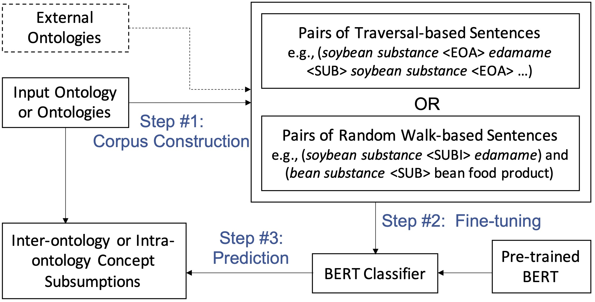

# Subsumption Prediction with BERTSubs

!!! credit "Paper"

    Paper for BERTSubs: [Contextual Semantic Embeddings for Ontology Subsumption Prediction (accepted by WWW Journal in 2023)](https://arxiv.org/abs/2202.09791).

    ```
    @article{chen2022contextual,
    title={Contextual semantic embeddings for ontology subsumption prediction},
    author={Chen, Jiaoyan and He, Yuan and Geng, Yuxia and Jimenez-Ruiz, Ernesto and Dong, Hang and Horrocks, Ian},
    journal={arXiv preprint arXiv:2202.09791},
    year={2022}
    }
    ```


This page gives the tutorial for $\textsf{BERTSubs}$ including the functions, the summary of the models and usage instructions.

<br>
The current version of $\textsf{BERTSubs}$ is able to predict:

1. named subsumptions between two named classes, or complex subsumptions between one named class and one complex class, **within an ontology**,
2. named subsumption between two named classes, or complex subsumptions between one named class and one complex class, **across two ontologies** (note the former corresponds to subsumption mapping). 
<br>

<p align="center">
    
    <p align="center">Figure 1. Pipeline illustration of BERTSubs.</p>
</p>

<br>
The pipeline of $\textsf{BERTSubs}$ consists of following steps.

1. **Corpus Construction**: extracting a set of sentence pairs from positive and negative subsumptions from the target ontology (or ontologies), with one of the following three templates used for transforming each class into a sentence,

    - Isolated Class, which just uses the names of the input class,
    - Path Context, which uses the names of the upper (resp. down) path starting from the input superclass (resp. subclass),
    - Breadth-first Class Context, which uses the names of the input class's surrounding classes.
   
3. **Model Fine-tuning**: fine-tuning a language model such as BERT with the above sentence pairs.
4. **Prediction**: using the fine-tuned language model to predict the subsumption scores of the given candidate class pairs.

Note that the optionally given subsumptions via a train subsumption file can also be used for fine-tuning. 
Please see more technical details in the [paper](https://arxiv.org/abs/2202.09791).


## Evaluation Case and Dataset (Ontology Completion)

The evaluation is implemented [scripts/bertsubs_intra_evaluate.py](https://github.com/KRR-Oxford/DeepOnto/blob/main/scripts/bertsubs_intra_evaluate.py).
Download an ontology (e.g., [FoodOn](https://github.com/KRR-Oxford/OWL2Vec-Star/blob/master/case_studies/ontologies.tar.gz)) and run:
```bash
python bertsubs_intra_evaluate.py --onto_file ./foodon-merged.0.4.8.owl
```

The parameter --subsumption_type can be set to **'restriction' for complex class subsumptions**, and **'named_class' for named class subsumptions**. Please see the programme for more parameters and their meanings.

It executes the following procedure:

1. The named class or complex class subsumption axioms of an ontology is partitioned into a train set, a valid set and a test set. They are saved as train, valid and test files, respectively.

2. The test and the valid subsumption axioms are removed from the original ontology, and a new ontology is saved.

Notice: for a named class test/valid subsumption, a set of negative candidate super classes are extracted from the ground truth super class's neighbourhood.
For a complex class test/valid subsumption, a set of negative candidate super classes are randomly extracted from all the complex classes in the ontology.


## Usage

To run $\textsf{BERTSubs}$, a configuration file and one input ontology (or two ontologies) are mandatory.
If candidate class pairs are given, a fine-tuned language model and a file with predicted scores of the candidate class pairs in the test file are output;
otherwise, only the fine-grained language model is output.
The test metrics (MRR and Hits@K) can also be output if the ground truth and a set of negative candidate super classes are given for the subclass of each valid/test subsumption. 

1. The following code is for intra-ontology subsumption.
```python
from yacs.config import CfgNode
from deeponto.subs.bertsubs import BERTSubsIntraPipeline, DEFAULT_CONFIG_FILE_INTRA
from deeponto.utils import FileUtils
from deeponto.onto import Ontology

config = CfgNode(FileUtils.load_file(DEFAULT_CONFIG_FILE_INTRA)) # Load default configuration file
config.onto_file = './foodon.owl'
config.train_subsumption_file = './train_subsumptions.csv' # optional
config.valid_subsumption_file = './valid_subsumptions.csv' # optional
config.test_subsumption_file = './test_subsumptions.csv' #optional
config.test_type = 'evaluation' #'evaluation': calculate metrics with ground truths given in the test_subsumption_file; 'prediction': predict scores for candidate subsumptions given in test_submission_file
config.subsumption_type = 'named_class'  # 'named_class' or 'restriction' 
config.prompt.prompt_type = 'isolated'  # 'isolated', 'traversal', 'path' (three templates)

onto = Ontology(owl_path=config.onto_file)
intra_pipeline = BERTSubsIntraPipeline(onto=onto, config=config)
```

2. The following code is for inter-ontology subsumption.
```python
from yacs.config import CfgNode
from deeponto.subs.bertsubs import BERTSubsInterPipeline, DEFAULT_CONFIG_FILE_INTER
from deeponto.utils import FileUtils
from deeponto.onto import Ontology

config = CfgNode(FileUtils.load_file(DEFAULT_CONFIG_FILE_INTER)) # Load default configuration file
config.src_onto_file = './helis2foodon/helis_v1.00.owl'
config.tgt_onto_file = './helis2foodon/foodon-merged.0.4.8.subs.owl'
config.train_subsumption_file = './helis2foodon/train_subsumptions.csv' # optional
config.valid_subsumption_file = './helis2foodon/valid_subsumptions.csv' # optional
config.test_subsumption_file = './helis2foodon/test_subsumptions.csv' # optional
config.test_type = 'evaluation' # 'evaluation', or 'prediction'
config.subsumption_type = 'named_class'  # 'named_class', or 'restriction'
config.prompt.prompt_type = 'path'   # 'isolated', 'traversal', 'path' (three templates)

src_onto = Ontology(owl_path=config.src_onto_file)
tgt_onto = Ontology(owl_path=config.tgt_onto_file)
inter_pipeline = BERTSubsInterPipeline(src_onto=src_onto, tgt_onto=tgt_onto, config=config)
```

For more details on the configuration, please see the comment in the default configuration files 
[default_config_intra.yaml](https://github.com/KRR-Oxford/DeepOnto/blob/main/src/deeponto/subs/bertsubs/default_config_intra.yaml)
and [default_config_inter.yaml](https://github.com/KRR-Oxford/DeepOnto/blob/main/src/deeponto/subs/bertsubs/pipeline_inter.py).
