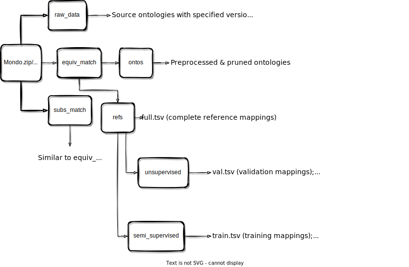

# Bio-ML: A Comprehensive Documentation

!!! credit "paper"

    Paper for Bio-ML:
    [Machine Learning-Friendly Biomedical Datasets for Equivalence and Subsumption Ontology Matching (ISWC 2022)](https://link.springer.com/chapter/10.1007/978-3-031-19433-7_33). It was nominated as the **best resource paper candidate** at ISWC 2022.

    ```
    @inproceedings{he2022machine,
      title={Machine Learning-Friendly Biomedical Datasets for Equivalence and Subsumption Ontology Matching},
      author={He, Yuan and Chen, Jiaoyan and Dong, Hang and Jim{\'e}nez-Ruiz, Ernesto and Hadian, Ali and Horrocks, Ian},
      booktitle={The Semantic Web--ISWC 2022: 21st International Semantic Web Conference, Virtual Event, October 23--27, 2022, Proceedings},
      pages={575--591},
      year={2022},
      organization={Springer}
    }
    ```

## Overview

$\textsf{Bio-ML}$ is a comprehensive ontology matching (OM) dataset that includes five ontology pairs for both equivalence and subsumption ontology matching. Two of these pairs are based on the **Mondo** ontology, and the remaining three are based on the **UMLS** ontology. The construction of these datasets encompasses several steps:

- **Ontology Preprocessing**: This phase involves verifying the integrity of the ontology and eliminating deprecated or superfluous classes.
- **Ontology Pruning**: In this stage, a sub-ontology is obtained in accordance with a list of preserved class IRIs. For Mondo ontologies, class preservation is based on reference mappings, while for UMLS ontologies, it relies on semantic types (see [Ontology Pruning](#ontology-pruning)).
- **Subsumption Mapping Construction**: Reference subsumption mappings are built from reference equivalence mappings, subject to target class deletion. To clarify, if an equivalence mapping is utilised for constructing a subsumption mapping, its corresponding target ontology class will be discarded to enforce direct subsumption matching (see [Subsumption Mapping Construction](#subsumption-mapping-construction)).
- **Candidate Mapping Generation**: For the purpose of evaluating an Ontology Matching (OM) system using ranking-based metrics, we generate a list of negative candidate mappings for each reference mapping by employing various heuristics (see [Candidate Mapping Generation](#candidate-mapping-generation)).
- **Locality Module Enrichment** (NEW :star2:): Newly introduced in the OAEI 2023 version, the pruned ontologies are enriched with classes that serve as context (annotated as **not used in alignment**) for existing classes, leveraging the locality module technique (access the [code](https://github.com/ernestojimenezruiz/logmap-matcher/blob/master/src/test/java/uk/ac/ox/krr/logmap2/test/oaei/CreateModulesForBioMLTrack.java)). OM systems can use these supplemental classes as auxiliary information while excluding them from the alignment process. These additional classes will also be omitted from the final evaluation. 
- **Bio-LLM: A Special Sub-Track for Large Language Models** (NEW :star2:): Another addition to the OAEI 2023 version, we introduced a unique sub-track for Large Language Model (LLM)-based OM systems. This is achieved by extracting small but challenging subsets from the NCIT-DOID and SNOMED-FMA (Body) datasets (see [OAEI Bio-LLM 2023](#oaei-bio-llm-2023)).

## Useful Links

- **Dataset Download** (License: CC BY 4.0 International):
    - **OAEI 2022**: <https://zenodo.org/record/6946466> (see [OAEI Bio-ML 2022](#oaei-bio-ml-2022) for detailed description).
    - **OAEI 2023**: <to-be-released> (see [OAEI Bio-ML 2023](#oaei-bio-ml-2023) for detailed description).

- **Complete Documentation**: *<https://krr-oxford.github.io/DeepOnto/bio-ml/>* (this page).
- **Reference Paper**: *<https://arxiv.org/abs/2205.03447>* (revised arXiv version).
- **Official OAEI Page**: *<https://www.cs.ox.ac.uk/isg/projects/ConCur/oaei/index.html>* (system participation and results).


## Ontology Pruning

In order to derive scalable Ontology Matching (OM) pairs, the **ontology pruning** algorithm propoased in the $\textsf{Bio-ML}$ paper can be utilised. This algorithm is designed to trim a large-scale ontology based on certain criteria, such as involvement in a **reference mapping** or association with a particular **semantic type** (see [UMLS data scripts](https://github.com/KRR-Oxford/OAEI-Bio-ML/tree/main/data_scripts/umls_scripts)). The primary goal of the pruning function is to discard irrelevant ontology classes whilst preserving the relevant hierarchical structure. 

More specifically, for each class, denoted as $c$, that needs to be removed, subsumption axioms are created between the parent and child elements of $c$. This step is followed by the removal of all axioms related to the unwanted classes.

Once a list of class IRIs to be removed has been compiled, the ontology pruning can be executed using the following code:

```python
from deeponto.onto import Ontology, OntologyPruner

# Load the DOID ontology
doid = Ontology("doid.owl")

# Initialise the ontology pruner
pruner = OntologyPruner(doid)

# Specify the classes to be removed
to_be_removed_class_iris = [
    "http://purl.obolibrary.org/obo/DOID_0060158",
    "http://purl.obolibrary.org/obo/DOID_9969"
]

# Perform the pruning operation
pruner.prune(to_be_removed_class_iris)

# Save the pruned ontology locally
pruner.save_onto("doid.pruned.owl")  
```

## Subsumption Mapping Construction

Ontology Matching (OM) datasets often include equivalence matching, but **not** subsumption matching. However, it is feasible to create a subsumption matching task from an equivalence matching task. Given a list of **reference equivalence mappings**, which take the form of ${(c, c') | c \equiv c' }$, one can construct **reference subsumption mappings** by identifying the **subsumers** of $c'$ and producing ${(c, c'') | c \equiv c', c' \sqsubseteq c'' }$. We have developed a [subsumption mapping generator][deeponto.align.mapping.SubsFromEquivMappingGenerator] for this purpose.

```python
from deeponto.onto import Ontology
from deeponto.align.mapping import SubsFromEquivMappingGenerator, ReferenceMapping

# Load the NCIT and DOID ontologies
ncit = Ontology("ncit.owl")
doid = Ontology("doid.owl")

# Load the equivalence mappings
ncit2doid_equiv_mappings = ReferenceMapping.read_table_mappings("ncit2doid_equiv_mappings.tsv")  # The headings are ["SrcEntity", "TgtEntity", "Score"]

# Initialise the subsumption mapping generator 
# and the mapping construction is automatically done
subs_generator = SubsFromEquivMappingGenerator(
  ncit, doid, ncit2doid_equiv_mappings, 
  subs_generation_ratio=1, delete_used_equiv_tgt_class=True
)
```

`#!console Output:`
:   &#32;
    ```python
    3299/4686 are used for creating at least one subsumption mapping.
    3305 subsumption mappings are created in the end.
    ```

Retrieve the generated subsumption mappings with:

```python
subs_generator.subs_from_equivs
```

`#!console Output:`
:   &#32;
    ```python
    [('http://ncicb.nci.nih.gov/xml/owl/EVS/Thesaurus.owl#C9311',
      'http://purl.obolibrary.org/obo/DOID_120',
      1.0),
     ('http://ncicb.nci.nih.gov/xml/owl/EVS/Thesaurus.owl#C8410',
      'http://purl.obolibrary.org/obo/DOID_1612',
      1.0), ...]
    ```

> See a concrete data script for this process at [`OAEI-Bio-ML/data_scripts/generate_subs_maps.py`](https://github.com/KRR-Oxford/OAEI-Bio-ML/blob/main/data_scripts/generate_subs_maps.py).


The `subs_generation_ratio` parameter determines at most how many subsumption mappings can be generated from an equivalence mapping. The `delete_used_equiv_tgt_class` determines whether or not to sabotage equivalence mappings used for creating at least one subsumption mappings. If it is set to `#!python True`, then the target side of an (**used**) equivalence mapping will be marked as deleted from the target ontology. Then, apply ontology pruning to the list of to-be-deleted target ontology classes:

```python
from deeponto.onto import OntologyPruner

pruner = OntologyPruner(doid)
pruner.prune(subs_generator.used_equiv_tgt_class_iris)
pruner.save_onto("doid.subs.owl")
```

> See a concrete data script for this process at [`OAEI-Bio-ML/data_scripts/generate_cand_maps.py`](https://github.com/KRR-Oxford/OAEI-Bio-ML/blob/main/data_scripts/generate_cand_maps.py).

!!! note

    In the OAEI 2023 version, the **target class deletion** is disabled as modularisation counteracts the effects of such deletion. For more details, refer to [OAEI Bio-ML 2023](#oaei-bio-ml-2023).


## Candidate Mapping Generation

To evaluate an Ontology Matching (OM) model's capacity to identify correct mappings amid a pool of challenging negative candidates, we utilise the [negative candidate mapping generation][deeponto.align.mapping.NegativeCandidateMappingGenerator] algorithm as proposed in the Bio-ML paper. This algorithm uses [`idf_sample`][deeponto.align.mapping.NegativeCandidateMappingGenerator.idf_sample] to generate candidates that are textually ambiguous (i.e., with similar naming), and [`neighbour_sample`][deeponto.align.mapping.NegativeCandidateMappingGenerator.neighbour_sample] to generate candidates that are structurally ambiguous (e.g., siblings). The algorithm ensures that **none** of the reference mappings are added as negative candidates. Additionally, for subsumption cases, the algorithm carefully excludes **ancestors** as they are technically correct subsumptions.

Use the following Python code to perform this operation:

```python
from deeponto.onto import Ontology
from deeponto.align.mapping import NegativeCandidateMappingGenerator, ReferenceMapping
from deeponto.align.bertmap import BERTMapPipeline

# Load the NCIT and DOID ontologies
ncit = Ontology("ncit.owl")
doid = Ontology("doid.owl")

# Load the equivalence mappings
ncit2doid_equiv_mappings = ReferenceMapping.read_table_mappings("ncit2doid_equiv_mappings.tsv")  # The headings are ["SrcEntity", "TgtEntity", "Score"]

# Load default config in BERTMap
config = BERTMapPipeline.load_bertmap_config()

# Initialise the candidate mapping generator
cand_generator = NegativeCandidateMappingGenerator(
  ncit, doid, ncit2doid_equiv_mappings, 
  annotation_property_iris = config.annotation_property_iris,  # Used for idf sample
  tokenizer=Tokenizer.from_pretrained(config.bert.pretrained_path),  # Used for idf sample
  max_hops=5, # Used for neighbour sample
  for_subsumptions=False,  # Set to False because the input mappings in this example are equivalence mappings
)

# Sample candidate mappings for each reference equivalence mapping
results = []
for test_map in ncit2doid_equiv_mappings:
    valid_tgts, stats = neg_gen.mixed_sample(test_map, idf=50, neighbour=50)
    print(f"STATS for {test_map}:\n{stats}")
    results.append((test_map.head, test_map.tail, valid_tgts))
results = pd.DataFrame(results, columns=["SrcEntity", "TgtEntity", "TgtCandidates"])
results.to_csv(result_path, sep="\t", index=False)
```

> See a concrete data script for this process at [`OAEI-Bio-ML/data_scripts/generate_cand_maps.py`](https://github.com/KRR-Oxford/OAEI-Bio-ML/blob/main/data_scripts/generate_cand_maps.py).

The process of sampling using *idf scores* was originally proposed in the BERTMap paper. The `annotation_property_iris` parameter specifies the list of annotation properties used to extract the **names** or **aliases** of an ontology class. The `tokenizer` parameter refers to a pre-trained sub-word level tokenizer used to build the inverted annotation index. These aspects are thoroughly explained in the [BERTMap tutorial](../bertmap).


## Evaluation Framework

Our evaluation protocol concerns two scenarios for OM: **global matching** for overall assessment and **local ranking** for partial assessment.
### Global Matching

As an overall assessment, given a **complete** set of reference mappings, an OM system is expected to compute a set of *true* mappings and compare against the reference mappings using Precision, Recall, and F-score metrics. With $\textsf{DeepOnto}$, the evaluation can be performed using the following code. 

> Download a <a href="../assets/example_reference_mappings.tsv" download>small fragment</a> to see the format of the prediction and reference mapping files. The three columns, `"SrcEntity"`, `"TgtEntity"`, and `"Score"` refer to the source class IRI, the target class IRI, and the matching score.

```python
from deeponto.align.evaluation import AlignmentEvaluator
from deeponto.align.mapping import ReferenceMapping, EntityMapping

# load prediction mappings and reference mappings
preds = EntityMapping.read_table_mappings(f"{experiment_dir}/bertmap/match/repaired_mappings.tsv")
refs = ReferenceMapping.read_table_mappings(f"{data_dir}/refs_equiv/full.tsv")
# compute the precision, recall and F-score metrics
results = AlignmentEvaluator.f1(preds, refs)
print(results)
```

`#!console Output:`
:   &#32;
    ```python
    {'P': 0.887, 'R': 0.879, 'F1': 0.883}
    ```

For the semi-supervised setting where a set of training mappings is provided, the training set should also be loaded and set as **null** (neither positive nor negative) with `null_reference_mappings` during evaluation:

```python
train_refs = ReferenceMapping.read_table_mappings(f"{data_dir}/refs_equiv/train.tsv")
results = AlignmentEvaluator.f1(preds, refs, null_reference_mappings=train_refs)
```

As for the OAEI 2023 version, some prediction mappings could involve classes that are marked as **not used in alignment**. Therefore, we need to filter out those mappings before evaluation.

```python
from deeponto.onto import Ontology
from deeponto.align.oaei import *

# load the source and target ontologies and  
# extract classes that are marked as not used in alignment
src_onto = Ontology("src_onto_file")
tgt_onto = Ontology("tgt_onto_file")
ignored_class_index = get_ignored_class_index(src_onto)
ignored_class_index.update(get_ignored_class_index(tgt_onto))

# filter the prediction mappings
preds = remove_ignored_mappings(preds, ignored_class_index)

# then compute the results
results = AlignmentEvaluator.f1(preds, refs, ...)
```

!!! tips

    We have encapsulated above features in the [`matching_eval`][deeponto.align.oaei.matching_eval] function in the OAEI utilities.

However,

- The scores will be biased towards high-precision, low-recall OM systems if the set of reference mappings is incomplete. 
- For efficient OM system development and debugging, an intermediate evaluation is required.

Therefore, the ranking-based evaluation protocol is presented as follows.

### Local Ranking

An OM system is also expected to **distinguish the reference mapping** among a set of candidate mappings and the performance can be reflected in Hits@K and MRR metrics. 

!!! warning 

    The reference subsumption mappings are inherently incomplete, so only the ranking metrics are adopted in evaluating system performance in subsumption matching.

> Download a <a href="../assets/example_candidate_mappings.tsv" download>small fragment</a> to see the format of the reference mapping and its candidate mappings. The `"SrcEntity"` and `"TgtEntity"` columns refer to the source class IRI and the target class IRI involved in a **reference mapping**. The `"TgtCandidates"` column stores a sequence of target candidate class IRIs (**including the correct one**) used for ranking, which can be accessed by the built-in Python function `eval`.

With $\textsf{DeepOnto}$, the evaluation can be performed as follows. First, an OM system needs to assign a score to each target candidate class and save the results as a list of tuples `(tgt_cand_class_iri, matching_score)`. 

```python
from deeponto.utils import FileUtils
import pandas as pd

test_candidate_mappings = FileUtils.read_table("test.cands.tsv").values.to_list()
ranking_results = []
for src_ref_class, tgt_ref_class, tgt_cands in test_candidate_mappings:
    tgt_cands = eval(tgt_cands)  # transform string into list or sequence
    scored_cands = []
    for tgt_cand in tgt_cands:
        # assign a score to each candidate with an OM system
        ...
        scored_cands.append((tgt_cand, matching_score))
    ranking_results.append((src_ref_class, tgt_ref_class, scored_cands))
# save the scored candidate mappings in the same format as the original `test.cands.tsv`
pd.DataFrame(ranking_results, columns=["SrcEntity", "TgtEntity", "TgtCandidates"]).to_csv("scored.test.cands.tsv", sep="\t", index=False)
```

Then, the ranking evaluation results can be obtained by:

```python
from deeponto.align.oaei import *

ranking_eval("scored.test.cands.tsv")
```

!!! tips

    If matching scores are not available, the target candidate classes should be **sorted** in descending order and saved in a list, the [`ranking_eval`][deeponto.align.oaei.ranking_eval] function will compute scores according to the sorted list.


## OAEI Bio-ML 2022

Below demonstrates the data statistics for the original Bio-ML used in the OAEI 2022. In the **Category** column, *"Disease"* indicates that the Mondo data are mainly about disease concepts, while *"Body"*, *"Pharm"*, and *"Neoplas"* denote semantic types of *"Body Part, Organ, or Organ Components"*, *"Pharmacologic Substance"*, and *"Neoplastic Process"* in UMLS, respectively. 

Note that each subsumption matching task is constructed from an equivalence matching task subject to **target ontology class deletion**, therefore `#TgtCls (subs)` is different with `#TgtCls`.

<center>
<small>

| Source | Task        | Category | #SrcCls | #TgtCls | #TgtCls($\sqsubseteq$)|#Ref($\equiv$)|#Ref($\sqsubseteq$) |
|--------|:-----------:|:--------:|:-------:|:-------:|:---------------:|:------------:|:-----------:|
| Mondo  | OMIM-ORDO   | Disease  | 9,642   | 8,838   | 8,735           | 3,721        | 103         |
| Mondo  | NCIT-DOID   | Disease  | 6,835   | 8,448   | 5,113           | 4,686        | 3,339       | 
| UMLS   | SNOMED-FMA  | Body     | 24,182  | 64,726  | 59,567          | 7,256        | 5,506       |
| UMLS   | SNOMED-NCIT | Pharm    | 16,045  | 15,250  | 12,462          | 5,803        | 4,225       |
| UMLS   | SNOMED-NCIT | Neoplas  | 11,271  | 13,956  | 13,790          | 3,804        | 213         |

</small>
</center>

The downloaded datasets (from Zenodo) include `Mondo.zip` and `UMLS.zip` for resources constructed from Mondo and UMLS, respectively. Each `.zip` file has three folders: `raw_data`, `equiv_match`, and `subs_match`, corresponding to the raw source ontologies, data for equivalence matching, and data for subsumption matching, respectively. The detailed structure is presented in the following figure. 

<br/>
<p align="center">
  
</p>


## OAEI Bio-ML 2023

The 2023 version has made several changes towards the previous version...

(to be updated)

locality module counters the effect of target class deletion (No #TgtCls(Subs)).

Below demonstrates the data statistics for the OAEI 2023 version of Bio-ML, where the input ontologies are extended to the modularization of their pruned versions used in 2022 (available at `raw_data`), through which **structural and logical contexts** are added and the input ontologies become closer to the original ontologies. To ensure the completeness of the original reference mappings, the added ontology classes are marked as **not used in alignment** through the annotation property `use_in_alignment` with a value of `false`. OM systems can choose to use these classes for enhancement but do not need to consider them for final output mappings. Even they are considered for the final output mappings, our evaluation will ensure that they are **excluded in the metric computation** (see [Evaluation Framework](#evaluation-framework)). 

In the **Category** column, *"Disease"* indicates that the Mondo data are mainly about disease concepts, while *"Body"*, *"Pharm"*, and *"Neoplas"* denote semantic types of *"Body Part, Organ, or Organ Components"*, *"Pharmacologic Substance"*, and *"Neoplastic Process"* in UMLS, respectively. 

The changes compared to the previous version (see [Bio-ML OAEI 2022](#bio-ml-oaei-2022)) are reflected in the `+` numbers of ontology classes. 

<center>
<small>

| Source | Task        | Category | #SrcCls         | #TgtCls         |#Ref($\equiv$)  |#Ref($\sqsubseteq$) |
|--------|:-----------:|:--------:|:----------------:|:---------------:|:-------------:|:------------:|
| Mondo  | OMIM-ORDO   | Disease  | 9,648 (+6)      | 9,275 (+437)    | 3,721          | 103          |
| Mondo  | NCIT-DOID   | Disease  | 15,762 (+8,927) | 8,465 (+17)     | 4,686          | 3,339        | 
| UMLS   | SNOMED-FMA  | Body     | 34,418 (+10,236)| 88,955 (+24,229)| 7,256          | 5,506        |
| UMLS   | SNOMED-NCIT | Pharm    | 29,500 (+13,455)| 22,136 (+6,886) | 5,803          | 4,225        |
| UMLS   | SNOMED-NCIT | Neoplas  | 22,971 (+11,700)| 20,247 (+6291)  | 3,804          | 213          |

</small>
</center>

The file structure for the download datasets (from Zenodo) is simplified this year to accommodate the changes.

Detailed structure is presented in the following figure (not yet available). 

<br/>
<p align="center">
  
</p>

## OAEI Bio-LLM 2023

As Large Language Models (LLMs) are trending in the AI community, we formulate a special sub-track for evaluating LLM-based OM systems. For efficient and insightful evaluation, we select two small yet representative subsets from the NCIT-DOID and SNOMED-FMA (Body) datasets, each consisting of 50 **matched** and 50 **unmatched** class pairs. 

We have evaluated some LLMs with several settings and submitted a poster paper. The results and more detail about this track will be released when the paper review is finished.

