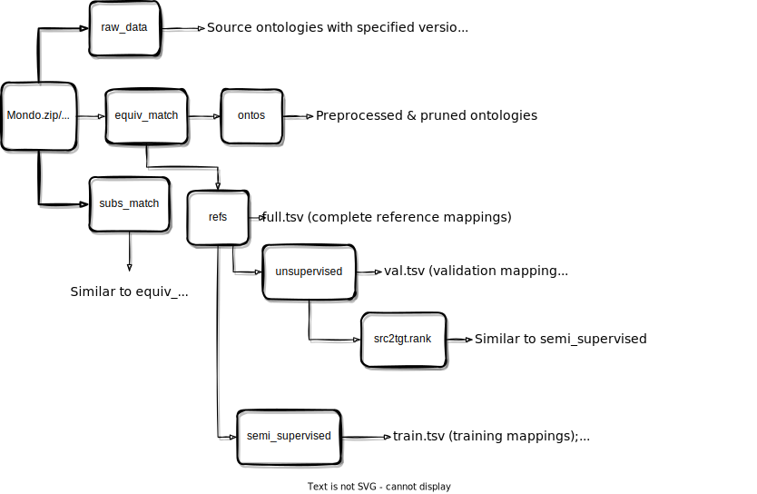

<!---
Copyright 2021 Yuan He (KRR-Oxford). All rights reserved.

Licensed under the Apache License, Version 2.0 (the "License");
you may not use this file except in compliance with the License.
You may obtain a copy of the License at

    http://www.apache.org/licenses/LICENSE-2.0

Unless required by applicable law or agreed to in writing, software
distributed under the License is distributed on an "AS IS" BASIS,
WITHOUT WARRANTIES OR CONDITIONS OF ANY KIND, either express or implied.
See the License for the specific language governing permissions and
limitations under the License.
-->

# Ontology Matching Resources

?> Besides model development and implementation, DeepOnto also aims to contribute new Ontology Matching (OM) resources and comprehensive evaluation workaround. In this page, we provide download links to our datasets and instructions for data usage.

## Bio-ML

The **Bio-ML** dataset provides five ontology pairs for both equivalence and subsumption ontology matching.

- **Download link**: *https://doi.org/10.5281/zenodo.6510086* (CC BY 4.0 International).
- **Resource Paper**: *https://arxiv.org/abs/2205.03447*.
- **OAEI Track**: *https://www.cs.ox.ac.uk/isg/projects/ConCur/oaei/*. 

### Data Statistics

<!-- tabs:start -->

#### **Equivalence Matching**

Statistics for the equivalence matching set-ups. In the **Category** column, *"Disease"* indicates that the Mondo data are mainly about disease concepts, while *"Body"*, *"Pharm"*, and *"Neoplas"* denote semantic types of *"Body Part, Organ, or Organ Components"*, *"Pharmacologic Substance*"*, and *"Neoplastic Process"* in UMLS, respectively.

<center>
<small>

| Source | Task        | Category | #Classes      | #RefMaps (equiv) | #Annot.  | AvgDepths |
|--------|:-----------:|:--------:|:-------------:|:----------------:|:--------:|:---------:|
| Mondo  | OMIM-ORDO   | Disease  | 9,642-8838    | 3,721            | 34K-34K  | 1.44-1.63 |
| Mondo  | NCIT-DOID   | Disease  | 6,835-8,848   | 4,684            | 80K-38K  | 2.04-6.85 |
| UMLS   | SNOMED-FMA  | Body     | 24,182-64,726 | 7,256            | 39K-711K | 1.86-9.32 |
| UMLS   | SNOMED-NCIT | Pharm    | 16,045-15,250 | 5,803            | 19K-220K | 1.09-3.26 |
| UMLS   | SNOMED-NCIT | Neoplas  | 11,271-13,956 | 3,804            | 23K-182K | 1.15-1.68 |

</small>
</center>


#### **Subsumption Matching**

Statistics for the subsumption matching set-ups. Note that each subsumption matching task is constructed from an equivalence matching task subject to target side class deletion.

<center>
<small>

| Source | Task        | Category | #Classes      | #RefMaps (subs)  |
|--------|:-----------:|:--------:|:-------------:|:----------------:|
| Mondo  | OMIM-ORDO   | Disease  | 9,642-8,735   | 103              | 
| Mondo  | NCIT-DOID   | Disease  | 6,835-5,113   | 3,339            | 
| UMLS   | SNOMED-FMA  | Body     | 24,182-59,567 | 5,506            | 
| UMLS   | SNOMED-NCIT | Pharm    | 16,045-12,462 | 4,225            | 
| UMLS   | SNOMED-NCIT | Neoplas  | 11,271-13,790 | 213              | 

</small>
</center>

<!-- tabs:end -->


### File Structure

The downloaded datasets include `Mondo.zip` and `UMLS.zip` for resources constructed from Mondo and UMLS, respectively.
Each `.zip` file has three folders: `raw_data`, `equiv_match`, and `subs_match`, corresponding to the raw source ontologies, data for equivalence matching, and data for subsumption matching, respectively. Detailed structure is presented in the following figure. 

<br/>
<p align="center">
  
</p>

### Evaluation Framework

There are two evaluation schemes (**local ranking** and **global matching**) and two data split settings (**unsupervised** and **(semi-)supervised**).

- For local ranking, an OM model is required to rank candidate mappings (in `test.cands.tsv`) generated from test mappings and evalute using `Hits@K` and `MRR`. 
  -  **Data Loading**: There are two options for loading the anchored candidate mapping:

  <!-- tabs:start -->

  #### **AnchoredOntoMappings**

  Load the whole data folder using [`AnchoredOntoMappings`](data_structures?id=anchoredontomappings) implemented in DeepOnto: 

  ```python
  from deeponto.onto.mapping import AnchoredOntoMappings
  AnchoredOntoMappings.read_table_mappings("test.cands.tsv")
  ```
  ?> [`AnchoredOntoMappings`](om_resources?id=anchoredontomappings) is essentially a dictionary with each reference mapping (in the form of class tuple) as a key (anchor) and its corresponding candidates (100 negative + 1 positive classes from the target ontology).

  #### **tsv**

  Load the `test.cands.tsv` directly, where the columns are `"SrcEntity"`, `"TgtEntity"`, and `"TgtCandidates"` standing for the source class iri of a test mapping, the target class iri of this test mapping, and the corresponding target candidate class iris in a sequence, which can be decoded using:
  
  ```python
  import ast
  ast.literal_eval(tgt_cands_seq)
  ```

  <!-- tabs:end -->

  - **Data Split**: the candidate mappings were separately generated w.r.t. the tesing data (`test.tsv`) in each data split.
    - *Unsupervised*: `test.cands.tsv` in `refs/unsupervised` refers to candidate mappings generated from `refs/unsupervised/test.tsv` and `refs/unsupervised/val.tsv` is ensured to be excluded from candidates.
    - *Semi-supervised*: `test.cands.tsv` in `refs/semi_supervised` referes to candidate mappings generated from `refs/semi_supervised/test.tsv` and `refs/semi_supervised/train+val.tsv` is ensured to be excluded from candidates.

- For global matching, an OM model is required to output full mappings and compare them with the reference mappings using `Precision`, `Recall`, and `F1`.
  - **Data Loading**: For each OM pair, a `refs/full.tsv` file is provided for full reference mapping; the columns of this `.tsv` file are `["SrcEntity", "TgtEntity", "Score"]` standing for the source reference class iri, target class iri, and the score (set to $1.0$ for reference mappings). 
  
  <!-- tabs:start -->

  #### **OntoMappings**

  Using [`OntoMappings`](data_structures?id=ontomappings) to load the mappings:

  ```python
  from deeponto.onto.mapping import OntoMappings
  m = OntoMappings.read_table_mappings("refs/full.tsv")
  ```

  #### **tsv**

  Standard `read_csv` function with `sep="\t"` can be used for loading the mappings; DeepOnto implements a `read_tables` method which takes care of potential errors of loading strings containing `NULL`:

  ```python
  from deeponto.utils import read_table
  m = read_table("refs/full.tsv")
  ```

  <!-- tabs:end -->

  - **Data Split**: the full reference mappings in `full.tsv` are divided into different splits for training (semi-supervised), validation, and testing purposes.
    -  *Unsupervised*: `val.tsv` and `test.tsv` are provided in `refs/unsupervised` for validation (10%) and testing (90%), respectively.
    -  *Semi-supervised*: `train.tsv`, `val.tsv`, `train+val.tsv` and `test.tsv` are provided in `refs/semi_supervised` for training (20%), validation (10%), merged training and validation file for evaluation, and testing (70%), respectively.
  - **Evaluation Caution**: When computing the scores (P, R, F1), mappings that are not in the testing set should be ignored by substraction from both system output and reference mappings. 
    - i.e., when evaluating on `refs/unsupervised/test.tsv`, `refs/unsupervised/val.tsv` should be ignored; when evaluating on `refs/semi_supervised/test.tsv`, `refs/semi_supervised/train+val.tsv` should be ignored. 
    - This feature is supported in [`om_eval.py`](bertmap?id=om-evaluation) script of DeepOnto where the arguement `null_ref_path` is for inputting the reference mappings that should be ignored.

- Since the subsumption mappings are inherently incomplete, we suggest apply only local ranking for evaluating subsumption matching.


## OM Data Construction

This section introduces essential scripts for processing ontology data and creating OM resources. The pruning, subsumption mapping generation, negative candidate mapping generation algorithms were proposed in our [resource paper](https://arxiv.org/abs/2205.03447).

### Ontology Pruning

The script `onto_prune.py` is used to prune an ontology by preserving classes according to a list of class IRIs while keeping the hierarchy. Specifically, if a class's IRI is not present in the input IRI list, then any axioms it involves will be deleted, and its parents will be asserted to be the parents of its children, so as to preserve the hierarchy. 

?> This can be seen as the most basic hierarchy preservation; in future, we will exploit logic modules to preserve more hierarchical information.

Parameters of `onto_prune.py`:

- **saved_path**(*str*): the path to the output directory.
- **src_onto_path**(*str*): the path to the source ontology that is about to be pruned.
- **preserved_iris_path**(*str*): the path to the file of class IRIs (one per line) that will be preserved.

Example usage of `onto_prune.py` for ontology pruning:

**Step 1**: Run the script with the above arguments specified.

```bash
python onto_prune.py \
--saved_path "./pruned_onto" \  
--src_onto_path "./data/src_onto.owl"
--preserved_iris_path "./preserved_class_iris.txt"

```

### Subsumption Mapping Generation

To construct inter-ontology subsumption mappings, we could utilize the **inter-ontology equivalence mappings** as the anchors. Specifically, we fix the source class of the equivalence mapping, and search for the ancestors (or descendants) of the target class, combining them with the source class to form the subsumption mappings. 

Parameters of `scripts/om_subs.py`: 

- **saved_path**(*str*): the path to the output directory.
- **src_onto**(*str*): the path to the source ontology file.
- **tgt_onto**(*str*): the path to the target ontology file.
- **equiv_maps_path**(*str*): the path to the equivalence mappings in `.tsv` with columns of `"SrcEntity"`, `"TgtEntity"`, and `"Score"`.
- **max_subs_ratio**(*int*): the maximum number of subsumption mappings generated for each input equivalence mapping, default is `1`.
- **is_delete_equiv_tgt**(*bool*): whether or not to delete the target class of the equivalence mapping used for generating any subsumption mappings. 
- **max_hop**(*int*): the maximum number of hops for searching the subsumption candidates, default is `1`, referring to the *most specific* subsumers.

Example usage of `om_subs.py` script for inter-ontology subsumption mapping construction:

**Step 1**: Run the script with arguments above specified.

```bash
python scripts/om_subs.py \
--saved_path "./subs_maps/" \  
--src_onto_path "./data/src_onto.owl" \
--tgt_onto_path "./data/tgt_onto.owl" \
--equiv_maps_path "./data/src2tgt_equiv_maps.tsv" \ 
--max_subs_ratio 1 \ 
--is_delete_equiv_tgt True \
--max_hop 1
```

If `is_delete_equiv_tgt` is set to be `True`, then it means we are corrupting the equivalence mappings (that are *used* for generating any subsumption mappings) by deleting their target side classes to prevent an OM system from inferring subsumptions directly from the equivalence mappings. In this case, the deleted target classes may intervene the generation of some subsumption candidates because they may occasionally appear in a generated subsumption mapping. Two algorithms (`online` or `static`) were proposed (see details in our [resource paper](https://arxiv.org/abs/2205.03447)) to deal with the class deletion. 

If `is_delete_equiv_tgt` is set to be `False`, choosing either algorithm will generate the same set of subsumption candidates because no classes will be marked for deletion.

**Step 2**: Choose which algorithm to be used and which subsumption relation to be considered. 

```bash
######################################################################
###                    Choose a Generation Type                    ###
######################################################################

[0]: static
[1]: online
Enter a number: 0

######################################################################
###                 Choose a Subsumption Relation                  ###
######################################################################

[0]: '<' (subClassOf)
[1]: '>' (superClassOf)
Enter a number: 0
```

There are two ways (`static` or `online`) of doing subsumption mapping construction with class deletion considered. By choosing `static`, target classes present in the equivalence mappings will be marked for deletion first unless they have no ancestors (resp. descendants) for `"<"` (resp. for `">"`) that can be used for constructing subsumption mappings; then it starts generating subsumption mappings and exclude those with target classes marked deleted. By choosing `online`, the deletion and construction are operated instantly for each iteration over the traversal of equivalence mappings; target classes of the equivalence mappings will not be omitted from deletion if they have been included in the subsumption mappings generated in the previous iterations.

In principle, `online` will generate more subsumption mappings than `static` because less classes are marked for deletion. However, `online` is less stable than `static` because it can be affected by the order of the equivalence mappings during traversal.

**Step 3**: If `is_delete_equiv_tgt` is set to be `True`, the script will generate target class IRIs that should be preserved. Then, the user need to manually run the `onto_prune.py` script described [above](using_deeponto?id=ontology-pruning) to delete the corresponding classes.


### Negative Candidate Mapping Generation

To come up with a meaningful evaluation over the input class pairs in `pair_score` mode, instead of using all the possible negative candidates, selecting representative (hard) ones is essential for evaluation efficiency and a decent approximation of overall performance. Ranking over the selected candidates is referred to as **local ranking** and can be evaluated using [`om_eval.py`](using_deeponto?id=om-evaluation).

Specifically, for each reference mapping $(c, c')$, we can fix the source side and sample negative candidates from the target side ontology, which can then be combined with the $c$ to form negative candidate mappings. As such, each reference mapping can be seen as an `AnchorMapping` that has $N$ `EntityMapping` as candidates (see explanation of mapping data structures [here](data_structures?id=mapping)).

Parameters of `om_cands.py` for generating target negative candidates:

- **saved_path**(*str*): the path to the output directory.
- **src_onto_path**(*str*): the path to the source ontology file.
- **tgt_onto_path**(*str*): the path to the target ontology file.
- **ref_mappings_path**(*str*): the path to the reference mapping file in `.tsv`.
- **null_ref_mappings_path**(*str*): the path to the null reference mapping file in `.tsv`. Such mappings should be ignored during the genration of candidates.
- **tokenizer_path**(*str*): the library path to the pre-trained (*hugginface*) tokenizer, default is `"emilyalsentzer/Bio_ClinicalBERT"`.
- **idf_sample_num**(*int*): the *desired* number of cadidates generated using IDFSample algorithm (see [paper](https://arxiv.org/abs/2205.03447)), default is `50`.
- **neighbour_sample_num**(*int*): the *desired* number of candidates generated using NeighbourSample algorithm (see [paper](https://arxiv.org/abs/2205.03447)), default is `50`.
- **max_hops**(*int*): the maximum number of hops for NeighbourSample search, default is `6`.
- **random_sample_num**(*int*): the number of candidates generated using RandomSample, which is also used to amend the number when IDFSample or NeighbourSample cannot generate the *desired* numbers (see [paper](https://arxiv.org/abs/2205.03447)); default is `0`.

Example usage of `scripts/om_cands.py` for generating negative candidate mappings from test mappings.

```bash
python scripts/om_cands.py \
--saved_path "./cand_maps" \
--src_onto_path "./data/src_onto.owl" \
--tgt_onto_path "./data/tgt_onto.owl" \
--ref_mappings_path "./data/test.tsv" \
--null_ref_mappings_path "./data/train+val.tsv" \
--tokenizer_path "emilyalsentzer/Bio_ClinicalBERT" \
--idf_sample_num 50 \
--neighbour_sample_num 50 \
--max_hops 6 \
--random_sample_num 0
```

## Mapping Datastructures

Several python classes for entity (in string) mappings are defined here as main data structrues used for OM system outputs and evaluation.

### EntityMapping

>  [:link:](https://github.com/KRR-Oxford/DeepOnto/blob/main/src/deeponto/onto/mapping.py)
*CLASS* &ensp; deeponto.onto.mapping.EntityMapping(<em>src_ent_iri: str, tgt_ent_iri: str, rel: str, score: float</em>)

The basic data structure for representing a mapping between entities.

Parameters for constructing a new `EntityMapping` object:
- **src_ent_iri**(<em>str</em>): the source entity IRI in string.
- **tgt_ent_iri**(<em>str</em>): the target entity IRI in string.
- **rel**(<em>str</em>): the semantic relation between the source and target entities.
- **score**(<em>float</em>): the score of the mapping ranging from $0.0$ to $1.0$.

Example usage for creating an equivalence entity mapping for `snomed:55940004` and `fma:54970`:

```python
from deeponto.onto.mapping import EntityMapping

src_ent_iri = "http://snomed.info/id/55940004"
tgt_ent_iri = "http://purl.org/sig/ont/fma/fma54970"

src2tgt_map = EntityMapping(
  src_ent_iri=src_ent_iri, 
  tgt_ent_iri=tgt_ent_iri, 
  rel="=",  # semantic relation symbol
  score=1.0 # score ranges from [0.0, 1.0]; 
            # 1.0 is usually set for a reference mapping
)
```

### AnchorMapping

>  [:link:](https://github.com/KRR-Oxford/DeepOnto/blob/main/src/deeponto/onto/mapping.py)
*CLASS* &ensp; deeponto.onto.mapping.AnchorMapping(<em>src_ent_iri: str, tgt_ent_iri: str, rel: str, score: float</em>)

It extends from the basic `EntityMapping` and can incorporate other entity mappings as its candidates.

Parameters for constructing a new `AnchorMapping` object:
- **src_ent_iri**(<em>str</em>): the source entity IRI in string.
- **tgt_ent_iri**(<em>str</em>): the target entity IRI in string.
- **rel**(<em>str</em>): the semantic relation between the source and target entities.
- **score**(<em>float</em>): the score of the mapping ranging from $0.0$ to $1.0$.

Example usage for constructing a new `AnchorMapping` and adding a `EntityMapping` as a candidate.

```python
from deeponto.onto.mapping import AnchorMapping

src_ent_iri = "http://snomed.info/id/55940004"
tgt_ent_iri = "http://purl.org/sig/ont/fma/fma54970"

anchor_map = AnchorMapping(
  src_ent_iri=src_ent_iri, 
  tgt_ent_iri=tgt_ent_iri, 
  rel="=", 
  score=1.0 # score ranges from [0.0, 1.0]; 
            # 1.0 is usually set for a reference mapping
)

cand_map = EntityMapping(...)
anchor_map.add_candidate(cand_map)
```

### OntoMappings

>  [:link:](https://github.com/KRR-Oxford/DeepOnto/blob/main/src/deeponto/onto/mapping.py)
*CLASS* &ensp; deeponto.onto.mapping.OntoMappings(<em>
        flag: str, 
        n_best: Optional[int],
        rel: str,
        dup_strategy: str,
        *ent_mappings: EntityMapping</em>)

The dict-based data structure which stores entity mappings of the same direction (`src2tgt` or `tgt2src`); the `map_dict` attribute stores entity mappings in form of a nested dictionary: 

```python
# {src_ent: {tgt_ent: score}}
{
  "http://snomed.info/id/55940004http://snomed.info/id/55940004": 
  {
    "http://purl.org/sig/ont/fma/fma54970": 1.0, 
    "http://purl.org/sig/ont/fma/fma34913": 0.563
  }
}
```

Parameters for constructing a new `OntoMappings` object:
- **flag**(<em>str</em>): the direction of the mapping (`src2tgt`, `tgt2src`).
- **n_best**(<em>int</em>): the number of top ranked mappings stored for each head entity, default is `None` which means there is no limit.
- **rel**(<em>str</em>): the semantic relation between the source and target entities.
- **dup_strategy**(<em>str</em>): the strategy used to dealing with new mappings that have duplicated source and target entities (`average`, `kept_old`, `kept_new`).
- **\*ent_mappings**(<em>EntityMapping</em>): sequence of `EntityMapping` to be added.

Entity mappings that belong to the same `src_ent` are sorted by scores in descending order, if `n_best` is set, only the top `n_best` mappings w.r.t. each `src_ent` will be kept.

Example usage for creating an `OntoMappings` object and feed mappings:

```python
from deeponto.onto.mapping import OntoMappings

onto_maps = OntoMappings(flag="src2tgt", n_best=10, rel="=")

# add a single mapping
onto_maps.add(src2tgt_map) # EntityMapping

# add many mappings
onto_maps.add_many(*list_of_src2tgt_maps) # List[EntityMapping]

# ranked mappings in [dict] with source entities as keys
onto_maps.map_dict

# return all mappings as tuples
onto_maps.to_tuples()

# return the top k ranked mappings for a source entity 
# that exceeds certain mapping score threshold
onto_maps.topks_for_ent(src_ent_iri, K=3, threshold: float = 0.5)

# save the mappings
# a .pkl file is saved for the object and a .json/.tsv file is saved for readability
onto_maps.save_instance("./src2tgt_maps")

# reload the mappings
onto_maps = OntoMappings.from_saved("./src2tgt_maps")

```

### AnchoredOntoMappings

>  [:link:](https://github.com/KRR-Oxford/DeepOnto/blob/main/src/deeponto/onto/mapping.py)
*CLASS* &ensp; deeponto.onto.mapping.AnchoredOntoMappings(<em>
        flag: str, 
        n_best: Optional[int],
        rel: str,
        dup_strategy: str,
        *anchor_mappings: AnchorMapping</em>)

It is a similar data structure as `OntoMappings` except that its keys are entity pairs (anchors) instead of a single source entity. It is essentially a collection of candidate mappings w.r.t. each 
anchor mapping (in `AnchorMapping`). For example, to generate negative candidates for each reference mapping (as an anchor) for [local ranking evaluation](using_deeponto?id=om-evaluation), we need to use the reference class pair as a double-key and add candidate mappings as values.

Parameters for constructing a new `AnchoredOntoMappings` object:
- **flag**(<em>str</em>): the direction of the mapping (`src2tgt`, `tgt2src`).
- **n_best**(<em>int</em>): the number of top ranked mappings stored for each anchor mapping, default is `None` which means there is no limit.
- **rel**(<em>str</em>): the semantic relation between the source and target entities.
- **dup_strategy**(<em>str</em>): the strategy used to dealing with new mappings that have duplicated source and target entities (`average`, `kept_old`, `kept_new`).
- **\*anchor_mappings**(<em>EntityMapping</em>): sequence of `AnchorMapping` to be added.

Example usage for creating an `AnchoredOntoMappings` object and feed mappings:
```python
from deeponto.onto.mapping import AnchoredOntoMappings

anchored_onto_maps = AnchoredOntoMappings(flag="src2tgt", n_best=10, rel="=")

# add an (reference) anchor mapping that has an unscored candidate mapping
anchor_map = AnchorMapping(ref_src_ent_iri, ref_tgt_ent_iri, "=", 1.0)
anchor_map.add_candidate(EntityMapping(ref_src_ent_iri, cand_tgt_ent_iri, "=", 0.0))
anchored_onto_maps.add(anchor_map)  

# flatten AnchoredOntoMappings to OntoMappings with all zero scores for
# conducting pair scoring prediction without duplicates
unscored_maps = anchored_onto_maps.unscored_cand_maps() 

# feed the scored OntoMappings back
# scored_maps <- some scoring method applied to unscored_maps
anchored_onto_maps.fill_scored_maps(scored_maps)

# saving and reloading are the same as OntoMappings
```

