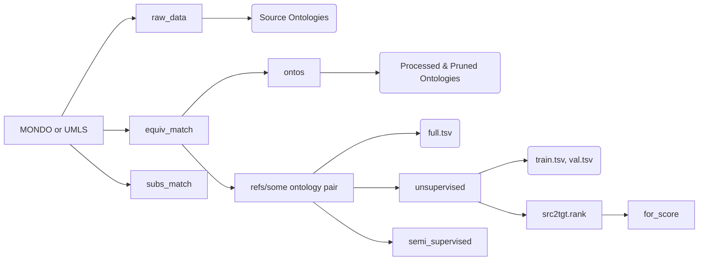

## Ontology Matching Resources

```mermaid
graph LR
M[MONDO/UMLS] --> RA[raw_data] --> O(Source Ontologies)
M[MONDO/UMLS] --> E[equiv_match] --> OT[ontos] --> OP(Processed & Pruned Ontologies)
E --> R[refs/some ontology pair] --> FU(full.tsv)
R --> US[unsupervised] --> TV(train.tsv, val.tsv)
US --> src2tgt.rank --> for_score
R --> SS[semi_supervised]
M[MONDO or UMLS] --> S[subs_match]
```