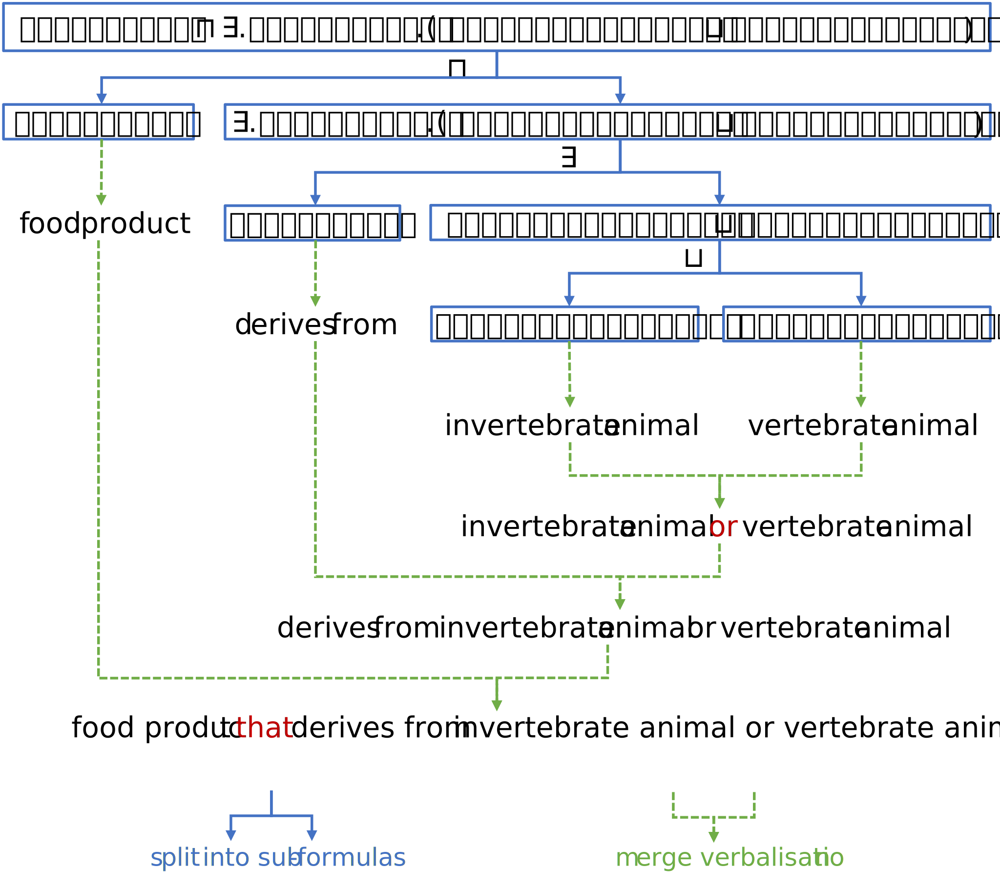

# Verbalise Ontology Concepts

Verbalising concept expressions is very useful for models that take textual inputs. While the named concepts can be verbalised simply using their names (or labels), complex concepts that involve logical operators require a more sophisticated algorithm. In $\textsf{DeepOnto}$, we have implemented the recursive concept verbaliser originally proposed in the OntoLAMA paper to address the need.

!!! credit "Paper"

    The recursive concept verbaliser is proposed in the paper:
    [Language Model Analysis for Ontology Subsumption Inference (Findings of ACL 2023)](https://aclanthology.org/2023.findings-acl.213).

    ```
    @inproceedings{he-etal-2023-language,
        title = "Language Model Analysis for Ontology Subsumption Inference",
        author = "He, Yuan  and
        Chen, Jiaoyan  and
        Jimenez-Ruiz, Ernesto  and
        Dong, Hang  and
        Horrocks, Ian",
        booktitle = "Findings of the Association for Computational Linguistics: ACL 2023",
        month = jul,
        year = "2023",
        address = "Toronto, Canada",
        publisher = "Association for Computational Linguistics",
        url = "https://aclanthology.org/2023.findings-acl.213",
        doi = "10.18653/v1/2023.findings-acl.213",
        pages = "3439--3453"
    }
    ```

This rule-based verbaliser (found in [`OntologyVerbaliser`][deeponto.onto.verbalisation.OntologyVerbaliser]) first parses a complex concept expression into a sub-formula tree (with [`OntologySyntaxParser`][deeponto.onto.verbalisation.OntologySyntaxParser]). Each intermediate node within the tree represents the decomposition of a specific logical operator, while the leaf nodes are named concepts or properties.  The verbaliser then recursively merges the verbalisations in a bottom-to-top manner, creating the overall textual representation of the complex concept. An example of this process is shown in the following figure:

</br>

<p align="center">
    
    <p align="center">Figure 1. Verbalising a complex concept recursively. </p>
</p>

</br>


To use the verbaliser, do the following:

```python
from deeponto.onto import Ontology, OntologyVerbaliser

# load an ontology and init the verbaliser
onto = Ontology("some_ontology_file.owl")
verbaliser = OntologyVerbaliser(onto)
```

To verbalise a complex concept expression:

```python
# get complex concepts asserted in the ontology
complex_concepts = list(onto.get_asserted_complex_classes())

# verbalise the first complex concept
v_concept = verbaliser.verbalise_class_expression(complex_concepts[0])
```

To verbaliser a class subsumption axiom:

```python
# get subsumption axioms from the ontology
subsumption_axioms = onto.get_subsumption_axioms(entity_type="Classes")

# verbalise the first subsumption axiom
v_sub, v_super = verbaliser.verbalise_class_subsumption_axiom(subsumption_axioms[0])
```

!!! tip

        The concept verbaliser is under development to incorporate the parsing of various axiom types. Please check the existing functions of [`OntologyVerbaliser`][deeponto.onto.verbalisation.OntologyVerbaliser] for specific usage.

Notice that the verbalised result is a `CfgNode` object which keeps track of the
recursive process. Users can access the final verbalisation by:

```python
result.verbal
```


Users can also manually update the vocabulary for named entities by:

```python
verbaliser.update_entity_name(entity_iri, entity_name)
```

This is useful when the entity labels are not naturally fitted into the verbalised sentence.


Moreover, users can see the parsed sub-formula tree using:

```python
tree = verbaliser.parser.parse(str(subsumption_axioms[0]))
tree.render_image()
```

Note that rendering the image requires `graphiviz` to be installed. Check this [link](https://graphviz.org/download/) for installing `graphiviz`.

> See an example with image at [`OntologySyntaxParser`][deeponto.onto.verbalisation.OntologySyntaxParser].
